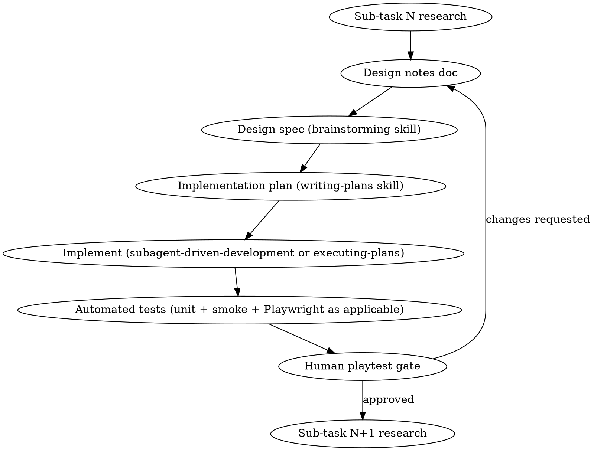

# Research-Driven World Polish

## Why this exists

This project's procedural-content initiatives (settlement buildings, shorelines,
terrain, biomes, props) repeatedly hit the same failure mode when skipped
straight to implementation: a plausible-looking fix ships, looks fine in one
screenshot, and turns out to be a shallow parametric tweak rather than a real
structural improvement — discovered only after the user notices the repetition
or blockiness is still there. The `organic_world_tiles_todo.md` roadmap and the
per-race building specs both exist because research-first work (reading how
Townscaper, Zelda BOTW, tabletop terrain kits, etc. actually solve this class of
problem) surfaced techniques that a "just add more noise/variants" pass would
never have found, and repeatedly caught that a technique the codebase needed
already existed half-built and unwired.

This skill locks in that lesson as the required process for any new large
procedural-quality initiative — outdoor now, indoor later, and anything else of
this shape — so the temptation to skip straight to code is structurally
prevented, not just discouraged.

## Core principle

**Research → Design notes → Spec → Plan → Implement → Test → Playtest gate**,
run once per sub-task, never collapsed. Every step produces a durable
artifact (a doc, a spec, a plan, a commit, a test result) — nothing is "understood
in-context and then implemented" without leaving evidence behind, because this
project's initiatives span many sessions and compaction/history loss is routine.

## The initiative → phase → sub-task hierarchy

A large initiative (e.g. "Overworld/Outdoor polish") is broken into **phases**
(e.g. Phase 1 = tiles/assets/elevation), and each phase into **sub-tasks** (e.g.
1.1 tile/subtile variety, 1.2 procedural asset kits, 1.3 elevation). Sub-tasks
run **in sequence, not in parallel** — each one completes its full cycle
(research through playtest gate) before the next starts, because later
sub-tasks in the same phase usually depend on decisions the earlier ones make
(e.g. 1.3's elevation blocks need to know what 1.1's tile/subtile modularity
looks like, or they'll be built to two incompatible grids).

## Step-by-step

### 1. Research

Before any design doc exists, spend a dedicated pass gathering:
- **How other games solve this** (search for the specific technique family —
  e.g. "Townscaper dual grid", "procedural tree L-systems", "erosion-based
  heightmap generation" — not just "how do games do terrain").
- **Named, citable techniques** (dual-grid marching squares, jittered-triangle
  relaxation, space colonization for trees, hydraulic erosion, etc.) — a
  technique you can name and look up is one you can verify was actually applied
  correctly later; "I made it a bit more random" is not a technique.
- **What already exists in this codebase** that half-solves the problem. This
  project has repeatedly found unwired-but-already-built machinery (e.g.
  `RelaxedMeshGrid.ts` built and never used, `fillWardOrganically()` already
  doing organic ward layout). Always check before building a second copy.
- **Tools/libraries/algorithms** that avoid reinventing infrastructure —
  noise libraries, mesh-relaxation algorithms, existing engine-neutral skills
  in this project (`procedural-gen`, `game-ai`, etc.) — but note this project's
  established preference for hand-rolled, dependency-light, engine-neutral
  code where reasonable; a library is worth adding only when the alternative is
  substantial reinvented complexity.

Write findings into a dated research/notes doc (`docs/superpowers/specs/` or a
dedicated `*_todo.md` roadmap doc, matching how `organic_world_tiles_todo.md`
was written) — cite sources, name the techniques, and call out what's already
in the codebase versus genuinely new.

### 2. Design notes → Spec

Feed the research into `superpowers:brainstorming` to pin down scope,
constraints, and open questions **before** writing the plan. Flag anything that
needs a human decision (art direction, "which of these 3 approaches") rather
than guessing — this project's history is full of specs explicitly deferring a
choice to the user instead of picking one silently (see the slime building
spec's blocked-on-art-direction note as the model to follow).

### 3. Plan

Use `superpowers:writing-plans` to turn the approved spec into a task-by-task
plan. Keep sub-tasks small enough that each can go through its own
implement→test→playtest cycle — do not write one giant plan for an entire
phase (e.g. 1.1+1.2+1.3 combined); write one plan per sub-task, informed by
what the prior sub-task's playtest gate confirmed.

### 4. Implement

Use `superpowers:subagent-driven-development` (same session) or
`superpowers:executing-plans` (parallel session) per that skill's own
guidance. Follow TDD throughout.

### 5. Automated tests

Whatever mix is appropriate to the change: unit tests for pure
generation/geometry logic (this project's established norm — see
`RealmToTerrain.test.ts`, `RealmRiverMesh.test.ts` for the pattern), a smoke
test if a new dev-lab/showroom surface is added, and a Playwright pass for
anything that needs live-rendered verification (this project has repeatedly
caught real regressions — silently-dropped geometry, wrong-facing props, black
silhouettes from a merge failure — only via live screenshots, never from unit
tests alone).

### 6. Human playtest gate — required, not optional

**Every sub-task ends with a checkpoint for the user to playtest it themselves
before the next sub-task starts.** This is not a formality:
- Report what changed and how to see it (dev room / dev sandbox route, seed to
  use, what to look for).
- Explicitly ask before proceeding to the next sub-task — do not chain sub-tasks
  across a compaction/session boundary without a human checkpoint in between.
- If the user's feedback contradicts an assumption from the research or spec
  step, that is real signal the earlier step missed something — revise the
  design notes/spec, not just the code, so the next sub-task doesn't repeat the
  same miss.

## Applying this across initiatives

This skill is intentionally not scoped to "outdoor" or "indoor" — the same
cycle applies to whichever world-quality initiative is active. When starting a
new phase (e.g. moving from outdoor to indoor polish later), re-read this
skill, then start a fresh research pass for that phase's first sub-task; do not
assume the outdoor research transfers without checking (some techniques will
transfer — e.g. dual-grid, kit-of-parts modularity — others won't, e.g.
elevation/erosion is outdoor-only).

## Red flags

**Never:**
- Skip straight from "user described what they want" to a plan or
  implementation without a dedicated research pass first
- Write one plan spanning multiple sub-tasks of a phase
- Mark a sub-task done without a human playtest checkpoint
- Silently pick between multiple valid art-direction approaches — surface the
  choice
- Build new machinery without first checking whether this codebase already
  has an unwired piece that solves it
