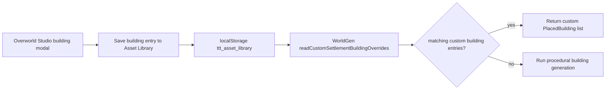

# Building Asset Library Runtime Overrides Design

## Summary

Extend the existing Asset Library runtime override pattern from custom settlement NPCs to custom settlement buildings.

This slice is intentionally narrow:
- **In scope:** runtime lookup of custom `building` Asset Library entries during settlement building generation in `src/procedural/WorldGen.ts`, plus focused tests
- **Out of scope:** new editor UI, new Asset Library actions, generic override frameworks, room-level overrides, world-package export changes

## Problem

The Asset Library already supports saving building blueprints from the Overworld Studio building modal, but the runtime does not yet consume those saved `building` entries as settlement building overrides.

Current state:
- Studio can save building blueprints to the Asset Library as `type='building'`
- `WorldGen.ts` already supports runtime override lookup for custom settlement NPC entries
- No equivalent runtime path exists for buildings, so saved building blueprints do not affect world generation

This leaves the Asset Library partially connected:
- designers can save buildings
- designers cannot yet cause those saved buildings to replace procedural settlement buildings at runtime

## Goals

1. Reuse the existing NPC override pattern in `WorldGen.ts`
2. Add the smallest possible building override lookup path
3. Keep world generation deterministic when no overrides exist
4. Allow custom building library entries to replace procedural settlement buildings for a settlement
5. Cover the new behavior with focused `WorldGen` tests

## Non-Goals

- No new Asset Library UI
- No building editing workflow
- No room blueprint override support
- No named-location generic abstraction
- No world-package export changes
- No changes to `building-viewer.html` behavior

## Options Considered

### Option A — Building overrides first
Add a `readCustomSettlementBuildingOverrides(...)` path in `WorldGen.ts` mirroring the current NPC override reader.

**Pros**
- Smallest code change
- Reuses a proven localStorage/library parsing pattern
- Easy to test using the existing `WorldGen.test.ts` style
- Delivers real runtime value for already-saved building entries

**Cons**
- Introduces a second override reader with similar logic
- May need modest expansion of saved building metadata to match entries reliably

**Recommendation:** **Chosen**

### Option B — Room blueprint overrides first
Consume saved building/dungeon room assets deeper in dungeon/room runtime paths.

**Pros**
- More granular customization
- Reaches blueprint-level runtime behavior

**Cons**
- Touches more systems
- Harder to define “identity” cleanly
- Larger than the next safe slice

### Option C — Generic named-location override framework
Build a shared abstraction for NPC/building/room/location overrides.

**Pros**
- Better long-term architecture
- Reduces duplicated parsing logic later

**Cons**
- Too large for the next slice
- More naming/schema decisions up front
- Higher regression risk

## Chosen Design

### 1. Runtime seam

Add a new internal helper in `src/procedural/WorldGen.ts`:

- `readCustomSettlementBuildingOverrides(settlementId, settlementSeed): PlacedBuilding[] | null`

And apply it at the start of:

- `generateSettlementBuildings(...)`

Behavior:
- If matching custom building overrides are found, return them
- Otherwise fall back to the existing procedural building generation path unchanged

This mirrors the NPC path:

- `readCustomSettlementNpcOverrides(...)`
- `generateSettlementNpcs(...)`

### 2. Matching strategy

A library entry qualifies as a building runtime override when:

- `entry.type === 'building'`
- `entry.isCustom === true`
- `entry.data` is an object with the minimum fields needed to reconstruct a `PlacedBuilding`

Entry matching should support settlement targeting in this order:

1. `data.settlementId === settlementId`
2. `entry.tags` contains `settlement:<settlementId>`
3. `entry.seed === settlementSeed`

This mirrors the current NPC override fallback strategy and keeps the slice resilient to slightly different save origins.

### 3. Required building override payload

The runtime reader should accept a custom building entry when `entry.data` contains enough information to reconstruct a `PlacedBuilding`.

Minimum accepted shape:

- `buildingId?: string`
- `kind`
- `style`
- `floors`
- `pos: { x, y?, z }`
- `rotation?: number`
- `seed?: number`
- `hasInterior?: boolean`
- `settlementId?: string`

Runtime reconstruction rules:
- `id` uses `data.buildingId` first, then `entry.id`, then a deterministic fallback
- `rotation` defaults to `0`
- `seed` defaults to `entry.seed`, then deterministic fallback from settlement seed
- `hasInterior` defaults to `kind !== 'well'`

### 4. Studio-side metadata adjustment

Because current building saves only include generic tags:

- `dtype:building`
- `floors:<n>`
- `startRoom:<id>`

the studio save path for buildings should be expanded to include settlement/building identity metadata when available from the modal context.

Target additional metadata:
- `settlementId`
- `buildingId`
- optionally `wardType` or similar descriptive tags if already available cheaply

Target additional tags:
- `settlement:<id>` when available
- `building:<id>` when available

This keeps the runtime matcher simple and avoids introducing heuristics based only on title or start room.

### 5. Data flow

### 6. Error handling

The reader must be defensive:
- return `null` if localStorage is unavailable
- ignore malformed entries
- ignore entries with invalid `kind`, `style`, `floors`, or `pos`
- never throw from world generation because of bad library data

Malformed custom building entries should simply be skipped.

### 7. Testing

Add focused tests to `tests/procedural/WorldGen.test.ts` modeled on the current NPC override test.

Required cases:

1. **Uses custom settlement building overrides from the asset library**
   - seed a normal world
   - capture first settlement id/seed
   - write one custom `building` entry to `ttt_asset_library`
   - regenerate world
   - assert overridden settlement buildings equal the custom building set

2. **Falls back to procedural building generation when no matching overrides exist**
   - ensure no library or unrelated entries
   - assert building count remains procedural

3. **Ignores malformed custom building entries**
   - write an invalid `building` entry
   - assert generation still succeeds

### 8. Scope boundaries for this slice

This slice stops once:
- `WorldGen.ts` can consume custom settlement building overrides
- building saves include enough identity metadata for matching
- tests cover the new behavior

Follow-up slices can later address:
- room overrides
- generic named-location overrides
- world-package export of custom blueprints
- Asset Library “Pin to map location” / “Edit DNA” actions

## Files Expected To Change

- `src/procedural/WorldGen.ts`
- `src/procedural/WorldGen.js`
- `src/overworld-studio.ts`
- `src/overworld-studio.js`
- `tests/procedural/WorldGen.test.ts`
- `tests/procedural/WorldGen.test.js`
- optionally `TODO/01-overworld-studio/asset-library.md` if the runtime override checkbox is updated in the same slice

## Acceptance Criteria

- Custom `building` Asset Library entries can override settlement building generation when tagged or keyed to a settlement
- Existing behavior is unchanged when no building overrides exist
- `WorldGen` tests cover the new override path
- No unrelated runtime/editor behavior changes are bundled into the slice